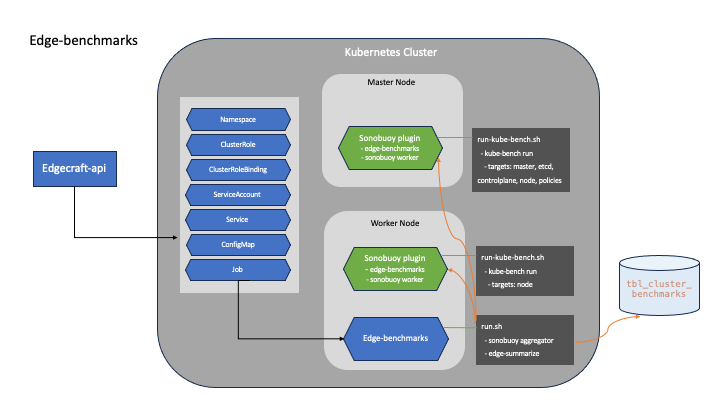

# Edge-Benchmarks

> CIS Benchmarks for Edgecraft Cluster


## Prerequisites

- `edge-summarize` build 
    
    ```bash
    make build
    ```
    
- `edge-benchmarks` container image 생성

    ```bash
    docker build -f package/Dockfile -t <image_name:tag> .
    ```

- `edgecraft-api`의 `conf/config.yml`에서 config 정보 반영 

    e.g.

    ```yaml
    benchmarks:
        image: 'ghcr.io/acornsoft-edgecraft/edge-benchmarks'
        version: '0.1.0'
        sonobuoy_image: 'edgecraft/sonobuoy'
        sonobuoy_version: 'v0.56.15'
        debug: 'false'    # true일 경우 Job 실행 완료 후 Pod가 종료되지 않는다.
    ```

## Workflow



- edge-benchmarks를 실행한다. 실행은 두가지 방법으로 가능하다.

    - `edgecraft-dashboard` 의 클러스터 `CIS Benchmarks` 메뉴에서 실행 

    - `edgecraft-api` 의 Swagger UI에서 실행

- 클러스터에 Namespace `edge-benchmarks`로 다음과 같은 관련 리소스를 생성한다. 

    - Namespace 

    - ClusterRole
    
    - ClusterRoleBinding
    
    - ServiceAccount
    
    - Service
    
    - ConfigMap
    
    - Job

- Job이 실행되면, `edge-benchmarks-{datetime}` Pod가 생성된다.

- `run.sh`를 통해 `sonobuoy aggregator`를 실행하면 `ConfigMap`에 설정된 configuration을 읽고 각 노드에서 플러그인을 실행한다.

- 플러그인은 각각의 노드에서 `run-kube-bench.sh`를 통해 `kube-bench` 실행 후 결과를 파일에 저장하고 sonobuoy에 완료되었음을(`done`) 알린다.

- sonobuoy는 완료된 파일을 확인 후 aggregator(`edge-benchmarks`)로 전송한다. 

- `edge-summarize`가 완료된 파일을 확인 후 요약하여 DB(`tbl_cluster_benchmarks`)에 저장한다.


#### [참고: [Sonobuoy Plugin](https://sonobuoy.io/docs/v0.56.15/plugins/)]


## 참고 및 주의사항

- **`FAIL`을 제외한, `PASS`, `WARN`, `INFO`는 준수한 것으로 간주한다.**

    - kubeadm: 92%

    - k3s: 99%

    - microk8s: ~~61%~~ 90%
    
- microk8s

    - [CIS hardening and assesment](https://microk8s.io/docs/how-to-cis-harden) 기반으로 작성된 [mk8s-1.23](https://github.com/acornsoft-edgecraft/craftctl/tree/main/edge-benchmarks/package/cfg/mk8s-1.23) config yaml로 실행된다.

    - worker node에서 알 수 없는 이유로 실행이 되지 않을 수 있다. 

        - kube-bench가 실행되는 sonobuoy plugin pod가 인터넷 접속이 되지 않음. 명확한 원인 및 해결책을 찾지 못함.
        
        - 클러스터 생성 후 시간이 지나면 발생 가능성이 높아짐.

        - worker node에서 `microk8s inspect` 실행 시 `FAIL:  Service snap.microk8s.daemon-k8s-dqlite is not running` 오류가 발생하지만 이것은 클러스터 생성 직후부터 발생하는 것으로 실행에는 영향을 주지 않음.

    - ~~microk8s는 구조적인 문제로 인해 Fail 수를 줄이기에 한계가 있다.~~

        - ~~e.g. permission, owner 등이 권장사항과 다름.~~

        - ~~현 버전에서 설정을 변경하면 Fail 수 줄이기가 가능은 함. 그렇지만 세가지 모두 90%를 넘어야함은 아니라 판단하여 종료.~~

        - ~~추후 시도해볼 경우 공식 가이드([CIS hardening and assesment](https://microk8s.io/docs/how-to-cis-harden))에 따라 작업하면 될 듯.~~

- k3s

    - [CIS Self Assessment Guide](https://docs.k3s.io/kr/security/self-assessment) 기반으로 작성된 [rke-cis-1.23-permissive](https://github.com/rancher/security-scan/tree/master/package/cfg/rke-cis-1.23-permissive) config yaml로 실행된다.

    - 다른 클러스터에 비해 실행시간이 조금 길다. 대략 5-6분.
