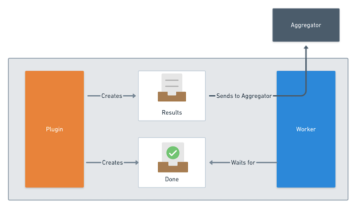

## Sonobuoy Plugins

> https://sonobuoy.io/
>
> https://github.com/vmware-tanzu/sonobuoy-plugins

Sonobuoy의 주요 기능은 플러그인 실행이다. 각 플러그인은 테스트를 실행하거나 클러스터에 데이터를 수집할 수 있다.

Sonobuoy를 처음 실행하면 선택한 configuration을 읽고 각 플러그인을 시작하는 aggregator pod가 클러스터에 생성된다. 그런 다음 aggregator는 각 플러그인이 결과를 다시 보고할 때까지 기다린다. 플러그인이 올바르게 실행되지 않거나 제한시간 내에 결과를 보고하지 않으면 오류가 기록된다.

### Plugin Types

- Job plugins

  Job plugins는 한번만 실행하면 되는 플러그인이다. Sonobuoy aggregator는 이 유형의 플러그인에 대한 단일 pod을 생성한다. kubernetes E2E plugin은 Job 유형의 플러그인이다.

- Daemonset plugins

  Daemonset plugins는 Control-plane 노드를 포함하여 모든 노드에서 실행해야 하는 플러그인이다. systemd-logs gatherer는 daemonset 유형의 플러그인이다.

### How Plugins Work

플러그인은 두 부분으로 나뉜다.

- 테스트를 실행하고 데이터를 수집하는 core logic (일반적으로 단일 컨테이너)

- aggregator에 데이터를 다시 보고하는 Sonobuoy가 추가한 sidecar

컨테이너가 작업을 완료한 후 Sonobuoy에 결과 파일 이름을 `done file`에 작성하여 완료되었음을 알린다. 기본값은 `/tmp/results/done`이며 sonobuoy 구성에서 `ResultsDir` 값으로 구성할 수 있다.

Sonobuoy 사이드카는 완료된 파일이 나타날 때까지 기다린 다음 표시된 파일을 다시 aggregator로 전송한다.



[출처: [Sonobuoy Plugins](https://sonobuoy.io/docs/v0.56.15/plugins/)]

### CIS Benchmarks Examples

> https://github.com/vmware-tanzu/sonobuoy-plugins/tree/main/cis-benchmarks

`sonobuoy run --plugin https://raw.githubusercontent.com/vmware-tanzu/sonobuoy-plugins/master/cis-benchmarks/kube-bench-plugin.yaml --plugin https://raw.githubusercontent.com/vmware-tanzu/sonobuoy-plugins/master/cis-benchmarks/kube-bench-master-plugin.yaml`

- TEST

```bash
~ % sonobuoy run --plugin https://raw.githubusercontent.com/vmware-tanzu/sonobuoy-plugins/master/cis-benchmarks/kube-bench-plugin.yaml --plugin https://raw.githubusercontent.com/vmware-tanzu/sonobuoy-plugins/master/cis-benchmarks/kube-bench-master-plugin.yaml
INFO[0000] create request issued                         name=sonobuoy namespace= resource=namespaces
INFO[0000] create request issued                         name=sonobuoy-serviceaccount namespace=sonobuoy resource=serviceaccounts
INFO[0000] create request issued                         name=sonobuoy-serviceaccount-sonobuoy namespace= resource=clusterrolebindings
INFO[0000] create request issued                         name=sonobuoy-serviceaccount-sonobuoy namespace= resource=clusterroles
INFO[0000] create request issued                         name=sonobuoy-config-cm namespace=sonobuoy resource=configmaps
INFO[0000] create request issued                         name=sonobuoy-plugins-cm namespace=sonobuoy resource=configmaps
INFO[0000] create request issued                         name=sonobuoy namespace=sonobuoy resource=pods
INFO[0000] create request issued                         name=sonobuoy-aggregator namespace=sonobuoy resource=services

~ % k get pod -A
sonobuoy      sonobuoy                                                       1/1     Running             0          6s
sonobuoy      sonobuoy-kube-bench-master-daemon-set-03bfa795daf84456-t4hhj   0/2     ContainerCreating   0          3s
sonobuoy      sonobuoy-kube-bench-node-daemon-set-73885194b6b4427f-dqqfg     0/2     ContainerCreating   0          3s

~ % sonobuoy status
              PLUGIN     STATUS   RESULT   COUNT   PROGRESS
   kube-bench-master   complete                1
     kube-bench-node   complete                1

Sonobuoy plugins have completed. Preparing results for download.

~ % k get pod -A
NAMESPACE     NAME                                                           READY   STATUS        RESTARTS   AGE
sonobuoy      sonobuoy                                                       1/1     Running       0          45s
sonobuoy      sonobuoy-kube-bench-master-daemon-set-03bfa795daf84456-t4hhj   2/2     Terminating   0          42s
sonobuoy      sonobuoy-kube-bench-node-daemon-set-73885194b6b4427f-dqqfg     2/2     Terminating   0          42s

~ % k logs sonobuoy -n sonobuoy
time="2023-02-08T07:18:50Z" level=info msg="Scanning plugins in ./plugins.d (pwd: /)"
time="2023-02-08T07:18:50Z" level=info msg="Scanning plugins in /etc/sonobuoy/plugins.d (pwd: /)"
time="2023-02-08T07:18:50Z" level=info msg="Directory (/etc/sonobuoy/plugins.d) does not exist"
time="2023-02-08T07:18:50Z" level=info msg="Scanning plugins in ~/sonobuoy/plugins.d (pwd: /)"
time="2023-02-08T07:18:50Z" level=info msg="Directory (~/sonobuoy/plugins.d) does not exist"
time="2023-02-08T07:18:50Z" level=info msg="Starting server Expected Results: [{os-sun-2-ms-7t9fx kube-bench-master 0} {os-sun-2-ws-q4tl7 kube-bench-node 0}]"
time="2023-02-08T07:18:50Z" level=info msg="Starting annotation update routine"
time="2023-02-08T07:18:50Z" level=info msg="Starting aggregation server" address=0.0.0.0 port=8080
time="2023-02-08T07:18:50Z" level=info msg="Received plugin launch order:"
time="2023-02-08T07:18:50Z" level=info msg="kube-bench-master: 0"
time="2023-02-08T07:18:50Z" level=info msg="kube-bench-node: 0"
time="2023-02-08T07:18:50Z" level=info msg="Running plugin" plugin=kube-bench-master
time="2023-02-08T07:18:50Z" level=info msg="Running plugin" plugin=kube-bench-node
time="2023-02-08T07:18:50Z" level=info msg="Launching plugin kube-bench-node with order 0"
time="2023-02-08T07:18:50Z" level=info msg="Launching plugin kube-bench-master with order 0"
time="2023-02-08T07:19:09Z" level=info msg="received request" client_cert="[kube-bench-master]" method=PUT node=os-sun-2-ms-7t9fx plugin_name=kube-bench-master url=/api/v1/results/by-node/os-sun-2-ms-7t9fx/kube-bench-master
time="2023-02-08T07:19:13Z" level=info msg="received request" client_cert="[kube-bench-node]" method=PUT node=os-sun-2-ws-q4tl7 plugin_name=kube-bench-node url=/api/v1/results/by-node/os-sun-2-ws-q4tl7/kube-bench-node
time="2023-02-08T07:19:18Z" level=info msg="All plugins have completed, status has been updated"
time="2023-02-08T07:19:20Z" level=info msg="Shutting down aggregation server"
time="2023-02-08T07:19:21Z" level=info msg="Resources is not set explicitly implying query all resources, but skipping secrets for safety. Specify the value explicitly in Resources to gather this data."
time="2023-02-08T07:19:21Z" level=info msg="Collecting Node Configuration and Health..."
time="2023-02-08T07:19:21Z" level=info msg="Creating host results for os-sun-2-ms-7t9fx under /tmp/sonobuoy/9cde5c33-b0ee-41d5-84f1-ec1cbcda623f/hosts/os-sun-2-ms-7t9fx\n"
time="2023-02-08T07:19:21Z" level=info msg="Creating host results for os-sun-2-ws-q4tl7 under /tmp/sonobuoy/9cde5c33-b0ee-41d5-84f1-ec1cbcda623f/hosts/os-sun-2-ws-q4tl7\n"
time="2023-02-08T07:19:21Z" level=info msg="Running cluster queries"
W0208 07:19:21.322196       1 warnings.go:70] policy/v1beta1 PodSecurityPolicy is deprecated in v1.21+, unavailable in v1.25+
W0208 07:19:21.425458       1 warnings.go:70] v1 ComponentStatus is deprecated in v1.19+
time="2023-02-08T07:19:21Z" level=info msg="Querying server version and API Groups"
time="2023-02-08T07:19:21Z" level=info msg="Filtering namespaces based on the following regex:.*"
time="2023-02-08T07:19:21Z" level=info msg="Namespace default Matched=true"
time="2023-02-08T07:19:21Z" level=info msg="Namespace kube-node-lease Matched=true"
time="2023-02-08T07:19:21Z" level=info msg="Namespace kube-public Matched=true"
time="2023-02-08T07:19:21Z" level=info msg="Namespace kube-system Matched=true"
time="2023-02-08T07:19:21Z" level=info msg="Namespace sonobuoy Matched=true"
time="2023-02-08T07:19:21Z" level=info msg="Running ns query (default)"
time="2023-02-08T07:19:21Z" level=info msg="Running ns query (kube-node-lease)"
time="2023-02-08T07:19:22Z" level=info msg="Running ns query (kube-public)"
time="2023-02-08T07:19:23Z" level=info msg="Running ns query (kube-system)"
time="2023-02-08T07:19:24Z" level=info msg="Running ns query (sonobuoy)"
time="2023-02-08T07:19:25Z" level=info msg="Namespace default Matched=false"
time="2023-02-08T07:19:25Z" level=info msg="Namespace kube-node-lease Matched=false"
time="2023-02-08T07:19:25Z" level=info msg="Namespace kube-public Matched=false"
time="2023-02-08T07:19:25Z" level=info msg="Namespace kube-system Matched=true"
time="2023-02-08T07:19:25Z" level=info msg="Namespace sonobuoy Matched=true"
time="2023-02-08T07:19:25Z" level=info msg="querying pod logs under namespace kube-system"
time="2023-02-08T07:19:25Z" level=info msg="Collecting Pod Logs by namespace (kube-system)"
time="2023-02-08T07:19:26Z" level=info msg="querying pod logs under namespace sonobuoy"
time="2023-02-08T07:19:26Z" level=info msg="Collecting Pod Logs by namespace (sonobuoy)"
time="2023-02-08T07:19:26Z" level=info msg="Collecting Pod Logs by FieldSelectors: []"
time="2023-02-08T07:19:26Z" level=info msg="recording query times at /tmp/sonobuoy/9cde5c33-b0ee-41d5-84f1-ec1cbcda623f/meta/query-time.json"
time="2023-02-08T07:19:26Z" level=info msg="Log lines after this point will not appear in the downloaded tarball."
time="2023-02-08T07:19:26Z" level=info msg="Invoking plugin cleanup" plugin=kube-bench-master
time="2023-02-08T07:19:26Z" level=info msg="Invoking plugin cleanup" plugin=kube-bench-node
time="2023-02-08T07:19:29Z" level=info msg="Results available at /tmp/sonobuoy/202302080718_sonobuoy_9cde5c33-b0ee-41d5-84f1-ec1cbcda623f.tar.gz"
time="2023-02-08T07:19:29Z" level=info msg="no-exit was specified, sonobuoy is now blocking"

~ % k get cm -n sonobuoy
NAME                  DATA   AGE
kube-root-ca.crt      1      17m
sonobuoy-config-cm    1      17m
sonobuoy-plugins-cm   2      17m
```
